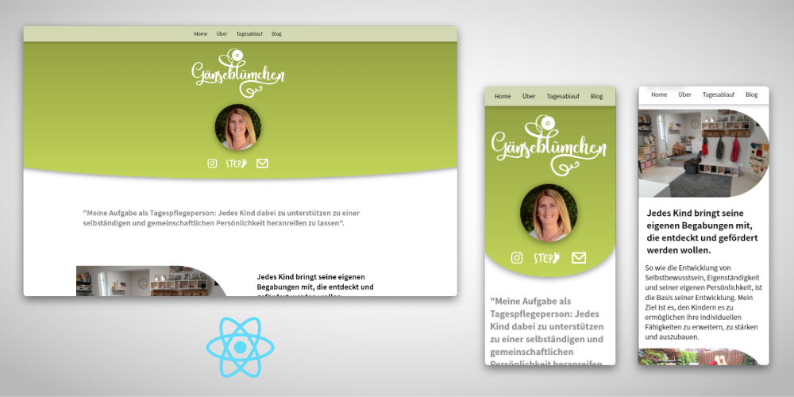

Meine Rolle: Frontend-Entwickler

Technologien: ReactJS | GraphQL | VS Code | Github

[Zur Website](https://www.gaensebluemchen-ladbergen.de)

**Für diese neue Portfolio-Seite brauchte ich kein herkömmliches CMS mehr und konnte alles in einem modernen Techstack programmieren**

Für eine Tagesmutter habe ich eine App programmiert, die bei Bedarf Daten von Socialmedia-Accounts abgreifen und auf die Seite laden kann. Es ist geplant, die häufig zu aktualisierenden Termine, mithilfe von **GraphQL** automatisch nachzuladen. Die einzelnen „Seiten“ werden über das **React-Routing** gesteuert.

Die Seite befindet sich derzeit noch in der Entwicklung.

&bull; &bull; &bull;
