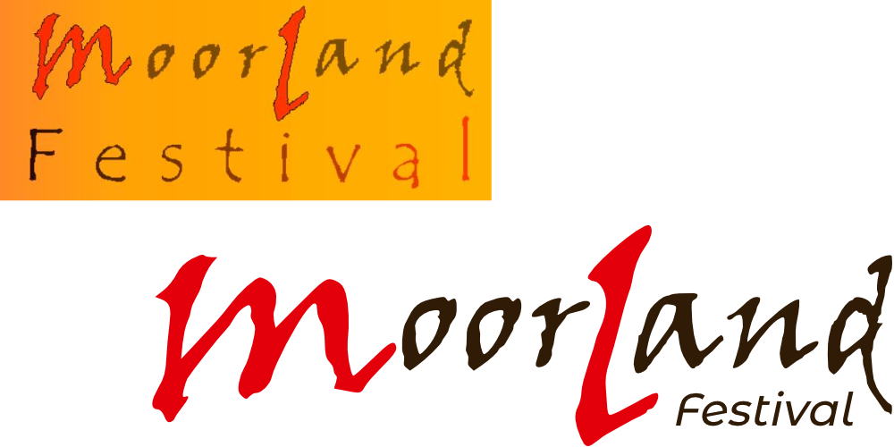

**Für das zweite Moorland-Festival sollten noch mehr Spendengelder für einem guten Zweck durch Besucher zusammenkommen.**

Die **User-Research** zeigte deutlich, dass das Design für den **kompletten Bevölkerungsdurchschnitt** passen sollte, aber auch gleichzeitig rocken musste. Damit bei allen Touchpoints die Kommunikation und Werbung flüssig und eingängig funktioniert, musste eine **modernere Website** programmiert und **flexiblere Farbkomposition-/harmonie** erstellt werden, auch das stark pixelige **Logo wurde erneuert.**

Da das ursprüngliche Schwarz zu dominant dem Gelb/Orange war, wurde es etwas zurückgenommen und neu angemischt und ein warmes Grau kam dazu, damit hatte man **genug Farben** zur Verfügung und war **flexibel.** Das Logo habe ich vektorisiert und neu zugerichtet, die Website brauchte kein CMS und &raquo;kostspielige&laquo; Module, da sie von mir für die Zeit gepflegt wurde.

Die frühzeitig bekannte Website, die Printwerbung, das **einheitliche CI** und vor allem die auftretenden Bands machten einen so soliden, rockigen und zugleich professionelleren Eindruck, dass sich die **Spendengelder verdoppelt** hatten. Auch die Berichterstattung in den Medien war durchweg positiv.
**10.000 € kamen für einen guten Zweck zusammen!**

Links das alte Konzept welches für diese Herausforderung zu unflexibel war, rechts das neue mit neuer Zurichtung der Buchstaben.  

Techstack: UX | HTML5 | CSS3 | JavaScript

&bull; &bull; &bull;
