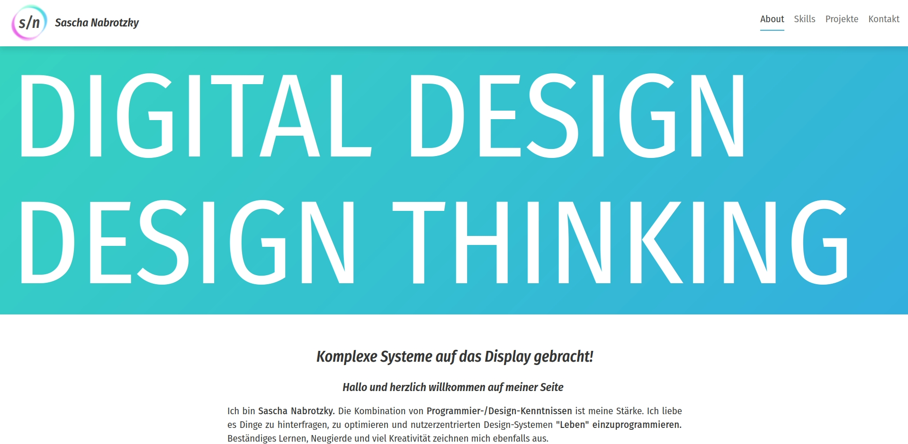

Meine Rolle: UX-Engineer

Technologien: React.js | Gatsby.js | SCSS | GraphQL

**Um meine berufliches Skillset bestmöglich zu präsentieren, programmierte ich meine eigene Portfolio-Seite in einem modernen Framework mit modernen CSS3-Design und auf Recruiter/Personalchefs abgestimmte Informationspräsentation**

Durch lange **User-Research** im Bereich Recruiter, Resumé-Aufbau/-Optimierung und was sofort ersichtlich werden sollte, setzte ich Texte über mich und meine Skills schnell erfassbar auf die Startseite. Ich wollte ursprünglich das ganze Design sehr reduziert halten, um eine schnell ladende Seite zu bekommen, es sollte mehr das programmatisch Funktionelle im Vordergrund stehen. Da meine **CSS3-Design-Skills** allerdings ebenfalls präsentiert werden sollten, entschied ich mich gegen ein reduziertes Design und nahm zusätzlich knallbunte Farben.

Als Hoster und Versionierungssystem habe ich **GitHub** ausgewählt, das kam mir für einen professionellen Auftritt sehr gelegen, da ich mich mit diesem Schritt noch mehr das Versionierungstool benutzen konnte. Die Texte und Bilder für z. B. die Projektseite, hole ich mithilfe von **GraphQL** aus **Markup-Dateien** und werden dann als Liste auf die Seite geladen.

&bull; &bull; &bull;

