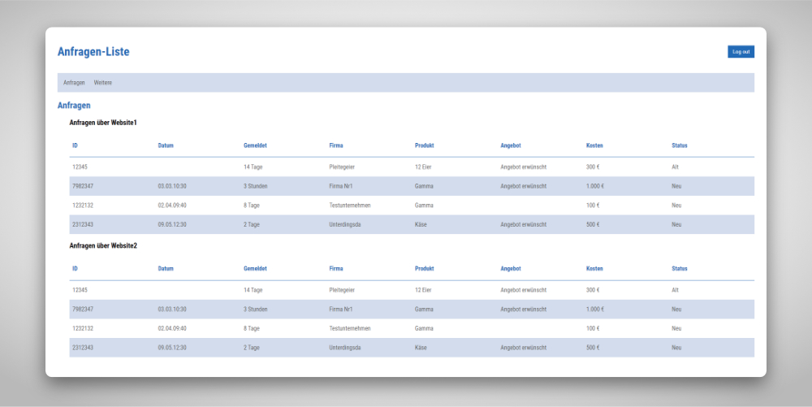

Meine Rolle: Frontend-Entwickler

Technologien: ReactJS | GatsbyJS | SCSS | GraphQL

**Um zukünftige Projekte vollumfänglich auf neuesten technologischen Stand zu bringen, hatte ich eine React-App erstellt, die Daten einer anderen Seite abfragt und als Liste darstellt.**

Um unabhängig von den bekannten Contentmanagement-Systemen, wie z. B. Wordpress und Joomla! zu sein, hatte ich während einer Aufgabe eine Website mit **React, HTML5 und SCSS** gebaut. Zudem wollte ich mehrere Artikel via **GraphQL** von der Website **Contentful** abfragen, die dann als Liste in die Seite laufen.

Der Vorteil dieser Vorgehensweise ist der modulare Aufbau einer Präsenz im Internet, denn dadurch kann man Inhalt und Darstellung technologisch trennen und besser austauschen.

&bull; &bull; &bull;

