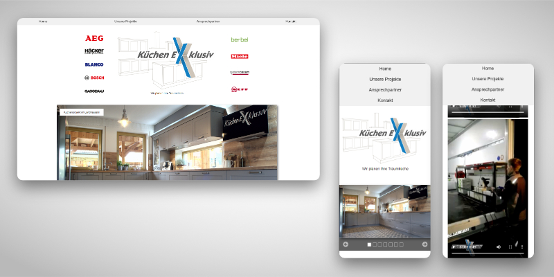

Eine ältere Website für ein Küchenstudio bei der es zu Anfang darauf ankam, sich selbst zu mit den Herstellern zu präsentieren und ein paar seiner eigenen Projekte zu zeigen. Dafür rutschte die übliche Slideshow eine Stufe nach unten und das Logo mit den Marken nach oben in den Fokus. Später kamen noch eigene Videos hinzu, die auch noch eingebunden wurden. Die Projekte wurden als Grid angelegt und man konnte mit einem Klick Modalboxen öffnen, die genauere Beschreibungen enthielten.

Die Seite wurde als eine Art "Visitenkarte" angelegt, da keine Inhalte selber eingestellt werden sollten, also musste ein CMS, wie Joomla!, dafür nicht eingerichtet werden.

HTML5 | CSS3 | JavaScript
