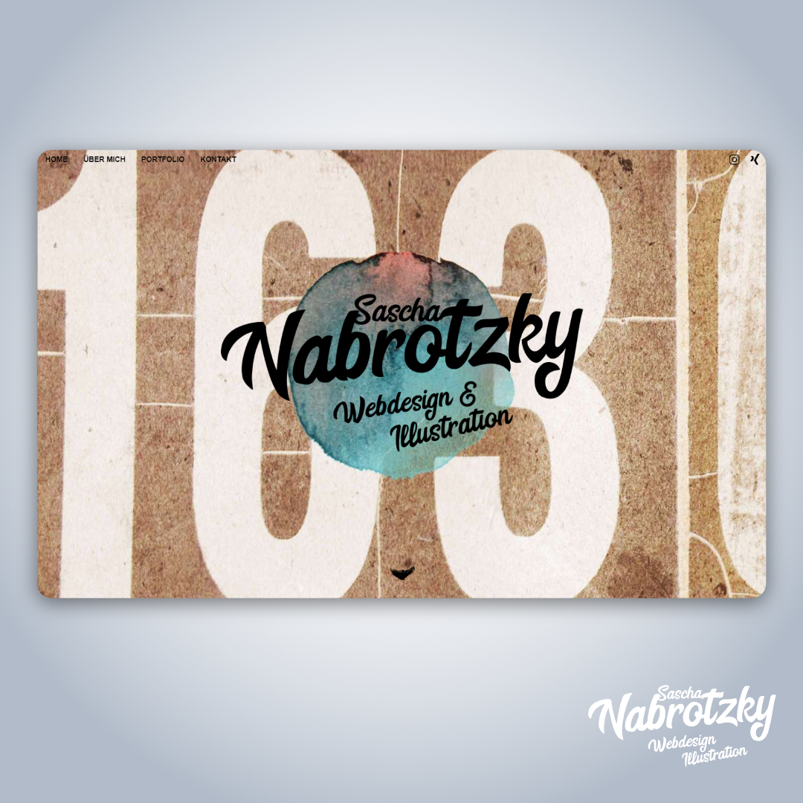

Meine Rolle: Frontend-Entwickler

Technologien: HTML5 | CSS3 | JavaScript | VS Code

**Meine urspüngliche alte Website sollte mich selbst optimal als Fachkraft für Webdesign kombiniert mit Illustrationen präsentieren.**

Die User-Research betrieb ich hauptsächlich durch **recherchieren im Internet und viel testen,** um herauszufinden, welche Stärken zu welchen Kunden passen und welches Angebot man nebenberuflich anbieten sollte. Ob alles Wirkung zeigt, überwachte ich mit Hilfe von Online-Analysetools. Von Anfang an habe ich das **Gesamtkonzept gedreht,** verworfen und immer wieder neu infrage gestellt. Ich reduzierte die angebotenen Leistungen und fokussierte mich auf zwei Sachen.
Das Logo sollte mit dem handschriftlichen Charakter das Illustrative darstellen, die erodierten Zahlen mein Interesse für ungewöhnliches Design.

Die Seite wurde von mir zu Anfang in <strong>HTML, CSS und JQuery</strong> erstellt, nach einiger Zeit stellte ich die Codestuktur auf das modernere HTML5, CSS3 um und JQuery wurde reines JavaScript ersetzt - auch Animationen wurden dort an einigen Stellen eingebracht und der Parallax-Effekt durfte auch nicht fehlen, aber die fehlende SSL Verbindung meiner Website war immer mehr ein Problem beim Ranking.

&bull; &bull; &bull;
