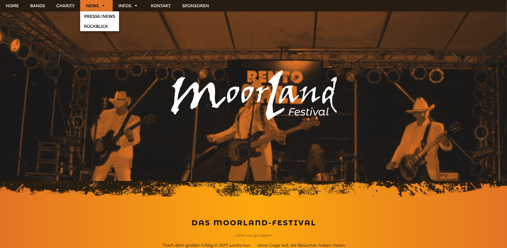

Meine Rolle: Frontend-Entwickler

Technologien: HTML5 | CSS3 | JavaScript

[Zur Website](http://www.sascha-nabrotzky.de/moorland/index.html)

**Für das zweite Moorland-Festival sollten noch mehr Spendengelder für einem guten Zweck durch Besucher zusammenkommen.**

Die **User-Research** zeigte, dass bei allen Touchpoints die Kommunikation und Werbung flüssig und eingängig funktionieren muss, also habe ich eine **responsive Website ohne CMS programmiert** und ein **flexibles Farbschema** erstellt. Mit einem neuen Farbschema konnte man trendig auftreten, Kontrast und Aufmerksamkeit erzeugen **bei gleichzeitiger Einhaltung der CI.**

Die **Informationsarchitektur** wurde so angelegt, dass man am Smartphone durch einfaches Scrollen alles nötige zum Fest erfährt, **SEO wurde so lange verbessert und getestet bis die Ladegeschwindigkeit passte** und man in den sozialen Medien die Seite optisch aufpoliert teilen kann.

Da das Charity-Festival in allen Bereichen gut aufgestellt war und über zwei Tage ging, konnten die **Spendengelder verdoppelt** werden – 10.000 € kamen einem guten Zweck zugute.

&bull; &bull; &bull;

