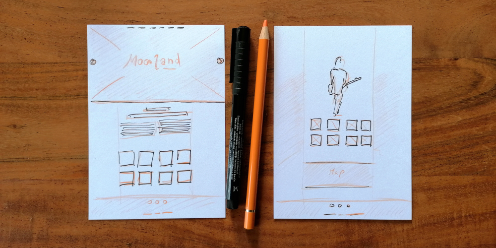

Meine Rolle: Frontend-Entwickler | UX-Designer | Mediengestalter

Technologien: HTML5 | CSS3 | JavaScript

[Zur Website](http://www.sascha-nabrotzky.de/moorland/index.html)

**Für das zweite Moorland-Festival sollten noch mehr Spendengelder für einen guten Zweck zusammenkommen.**

Die **User-Research** zeigte, dass bei allen Touchpoints die Kommunikation und Werbung flüssig und eingängig funktionieren muss, da das Festival auf allen Kanälen kommuniziert werden sollte (Online, Print). Also habe ich eine schlanke, **responsive Website** rein in **HTML5, CSS3** und **JavaScript** programmiert und ein **flexibles Farbschema** erstellt. Mit einem neuen Farbschema konnte ich grafischer gestalten und durch den Farbkontrast die nötige Aufmerksamkeit erzeugen bei gleichzeitiger **Einhaltung der CI.**

Die **Informationsarchitektur** wurde so angelegt, dass man am Smartphone durch einfaches Scrollen alles nötige zum Fest erfährt, **SEO** wurde so lange verbessert und getestet, bis die Ladegeschwindigkeit passte und man in den sozialen Medien die Seite optimal teilen kann.

Da das Charity-Festival in allen Bereichen gut aufgestellt war und über zwei Tage ging, konnten die **Spendengelder verdoppelt** werden – 10.000 € kamen einem guten Zweck zugute.

&bull; &bull; &bull;

