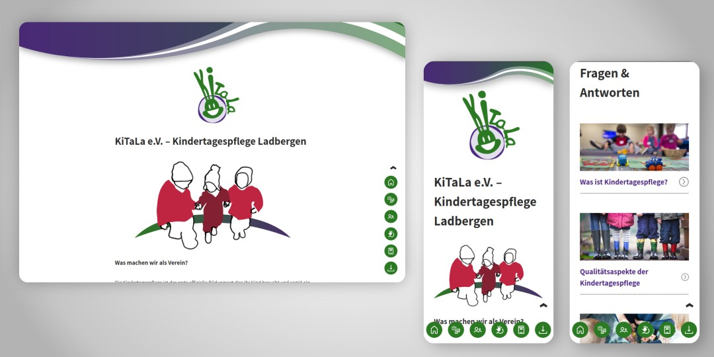
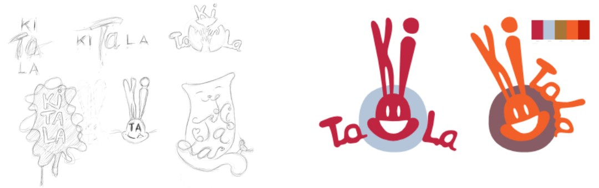

Meine Rolle: Frontend-Entwickler | UX-Designer | Mediengestalter

Technologien: React | SCSS | HTML5

[Zur Website](https://kitala-ladbergen.de)

**In Ladbergen haben die Tagesmütter einen Verein gegründet, ich erstellte die Website mit React, welche in Zukunft von mir weiter gepflegt und aktuell gehalten wird.**

Nach einer **online User-Research,** wie und was der Verein auf der Website idealerweise kommunizieren sollte (viele Daten hatte ich bereits aus vorherigen Projekten), plante ich mithilfe diverser Skizzen die einzelnen Bereiche der Seite. Ich sortierte nach **dynamischen und statischen React-Komponenten** und konnte somit recht schnell die grundsätzliche Struktur der Seite für das **Routing** planen.

Beim **Illustrieren des Logos** habe ich gleichzeitig auch das grundsätzliche **Farbschema erstellt.** Das Menü brachte ich nach unten in **Daumennähe,** da meist mit dem Smartphone nach Informationen über Tagesmütter gesucht wird.

&bull; &bull; &bull;

