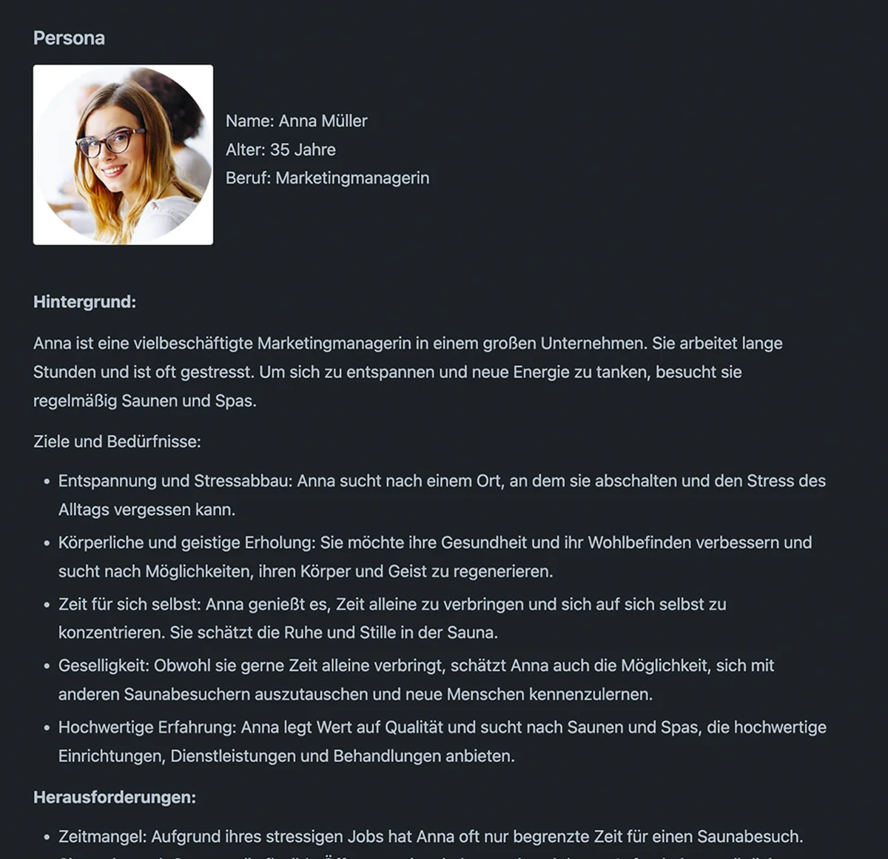
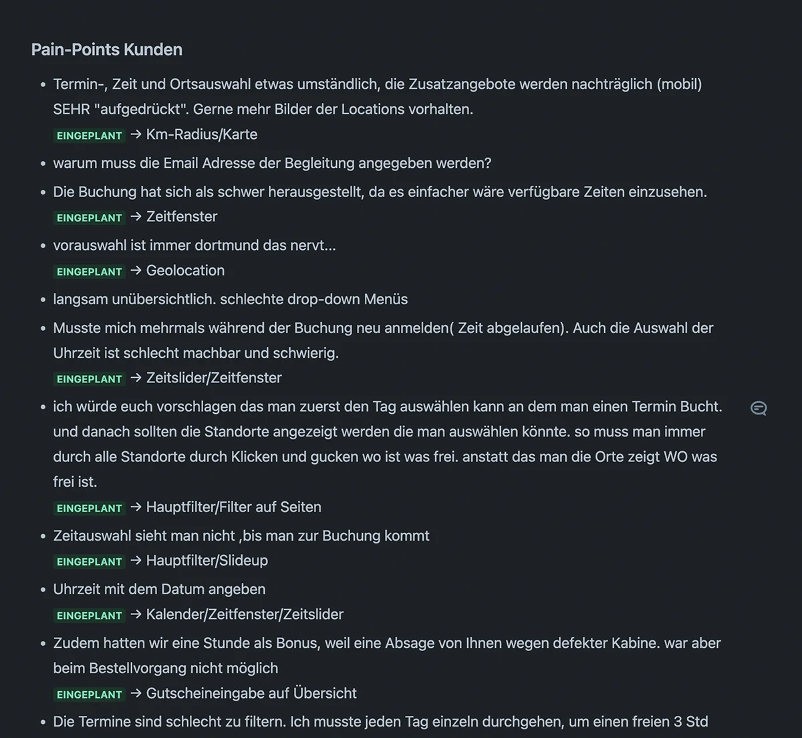

## 94% positive Resonanz auf die Buchungsstrecke

<strong>Meine Rolle:</strong> UX Engineer |
<strong>Technologien:</strong> React, HTML, CSS, Figma

&#8593; <strong>Abb. 1: Entwickeln des User-Flows</strong> für besonders leicht verständliche und schnelle Buchung der Suiten. Startseite mit Filter fürs schnelle Suchen (li.), Schnellsuche per Radius (mi.), Auswahl der Startzeit mit Flyout-Filter, damit der Kunde schnell noch was ändern kann (re.).

    <button style="font-size: var(--fs-sm); color: var(--col-darkgray); font-weight: var(--fw-bold);">Projektbeschreibung +</button>

#### Herausforderung

Die alte Buchungsstrecke war unübersichtlich und langsam. Die Kunden haben sich oft beschwert, dass sie nicht schnell genug die gewünschte Suite buchen konnten da sie den Buchungsprozess häufig bei einer Änderung immer wieder neu durchlaufen mussten. Die Herausforderung war es, eine Buchungsstrecke zu entwickeln, die einfach und schnell zu bedienen ist und die Kunden zufriedenstellt, mit der Möglichkeit, die Buchung jederzeit zu ändern.

#### User-Research

- Sammeln und auswerten der **Kundenfeedbacks** und **E-Mails** der vergangenen 6 Monaten (Abb. 3).
- **Interviews** mit den anderen Abteilungen die Kundenkontakt haben, um herauszufinden, was die Kunden am meisten stört und um einen anderen Blickwinkel auf die Erwartungen an die neue Buchungsstrecke zu bekommen.
- Speziell die **Auswahl der Startzeit war ein großes Problem,** da die Kunden oft die falsche Zeit ausgewählt haben und dann die Buchung abbrechen mussten.

#### Umsetzung

1. Erstellen einer Proto-Persona auf Basis von KI-Daten (Abb. 2).
2. Erste **einfache Skizzen** wurden auf Basis der Recherche erstellt, um ein **Gefühl** für den User-Flow zu bekommen.
3. **Informationsarchitektur** und **Wireframing** der Hauptseiten für die eigentliche Buchung wurde anschließend in Figma weiter ausgearbeitet (Abb. 1).
4. **Übergabe** der ersten Wireframes an die Grafikabteilung, um die **Gestaltung** der Buchungsstrecke zu optimieren.
5. Das Frontend der Buchungsstrecke programmierte ich auf Basis des ausgearbeiteten Designs in **React, HTML** und **CSS**, danach Übergabe an die Backend-Entwickler.
6. **Pagespeed-Optimierung** wurden ausgeführt, damit die Buchungsstrecke schnell lädt, sowohl im Frontend, als auch im Backend.

#### Test und Validierung

- Die Buchungsstrecke wurde seiten- und komponentenweise mit **Heuristic Markup** und dem **5-Sekunden-Test** immer wieder iterativ überprüft und optimiert.
- Die Buchungsstrecke wurde mit **Usability-Tests** durch die Kunden direkt und durch **internes Expertenwissen** validiert.

#### Ergebnis

- **94% positive Resonanz** auf die neue Buchungsstrecke, aufgrund eines großen Live-Tests mit ca. 468 Kunden bei gleichzeitigem Funktionstest der gesamten Filiale.
- **Kaum Beschwerden** mehr im Service-Center über die Buchungsstrecke, die **Kunden sind zufrieden** und buchen schneller und einfacher.
- **Internen Preis** für den besonderen Einsatz, das überwältigende Ergebnis und die gute Zusammenarbeit mit den anderen Abteilungen erhalten.

&#8593; <strong>Abb. 2: Für die neue Buchungsstrecke</strong> und alle nachfolgenden Projekte habe ich eine <strong>Proto-Persona auf Basis von KI-Daten</strong> erstellt.

&#8593; <strong>Abb. 3: Ein halbes Jahr lang,</strong> habe ich zudem alle <strong>E-Mails gesammelt</strong> und bezüglich Probleme bei der Bedienung der alten Buchungsstrecke <strong>ausgewertet,</strong> um diese Pain-Points besonders zu beachten und nicht zu wiederholen.

