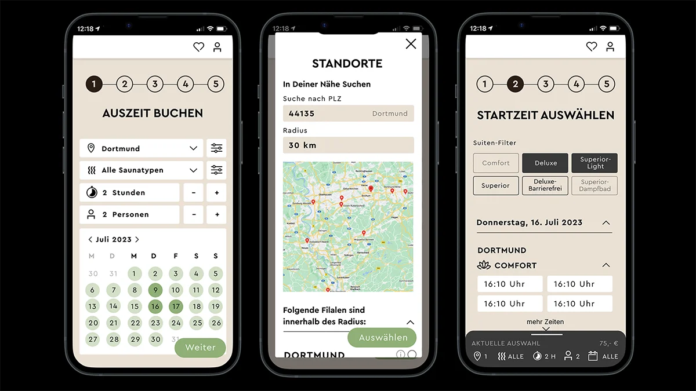

## 94% positive Resonanz für die Buchungsstrecke

<strong>Meine Rolle:</strong> UX-Designer und Frontend-Entwickler |
<strong>Technologien:</strong> React, HTML, CSS, Figma

&#8593; <strong>Fig. 1: Erste Wireframes</strong> und ausarbeiten des User-Flows für besonders leicht verständliche und schnelle Buchung der Suiten.

    <button style="font-size: var(--fs-sm); color: var(--col-darkgray); font-weight: var(--fw-bold);">Projektbeschreibung +</button>

#### Herausforderung

Die alte Buchungsstrecke war unübersichtlich und langsam. Die Kunden haben sich oft beschwert, dass sie nicht schnell genug die gewünschte Suite buchen konnten da sie den Buchungsprozess häufig bei einer Änderung immer wieder neu durchlaufen mussten. Die Herausforderung war es, eine Buchungsstrecke zu entwickeln, die einfach und schnell zu bedienen ist und die Kunden zufriedenstellt, mit der Möglichkeit, die Buchung jederzeit zu ändern.

#### User-Research

- xxx
- xxxx
- xxxx
- xxxx

#### Umsetzung

1. **Informationsarchitektur** und **Wireframing** auf Basis der Recherche wurde anschließend ausgearbeitet (Fig. x).
2. **Übergabe** der ersten Wireframes an die Grafikabteilung, um die **Gestaltung** der Buchungsstrecke zu optimieren.
3. Das Frontend der Buchungsstrecke programmierte ich in **React, HTML** und **CSS.**
4. **Pagespeed-Optimierung** wurden ausgeführt, damit die Buchungsstrecke schnell lädt.

#### Test und Validierung

- Die Buchungsstrecke wurde seiten- und komponentenweise mit **Heuristic Markup** und dem **5-Sekunden-Test** immer wieder iterativ überprüft und optimiert.
- Die Buchungsstrecke wurde mit **Usability-Tests** durch die Kunden direkt und durch internes Expertenwissen validiert.

#### Ergebnis

#### Learnings

- Nur mit **A/B-Tests** und Kundenfeedback kann man sich sicher sein, dass die Buchungsstrecke als einfach und schnell empfunden wird, ausschließlich **auf internes Wissen zu vertrauen reicht nicht aus.**
- **Kundenfeedback**, das auf zuvor geschenkter kostenloser Saunazeit basiert, ist **nicht immer aussagekräftig,** da die Kunden sich vermutlich nicht trauen, negative Kritik zu äußern.
- **Abteillungsübergreifende Teamarbeit** ist extrem wichtig, da man so zu richtig guten Ergebnissen kommt und nichts Wichtiges übersieht.  

&#8593; Erste Wireframes und ausarbeiten des User-Flows für besonders leicht verständliche und schnelle Buchung der Suiten.

