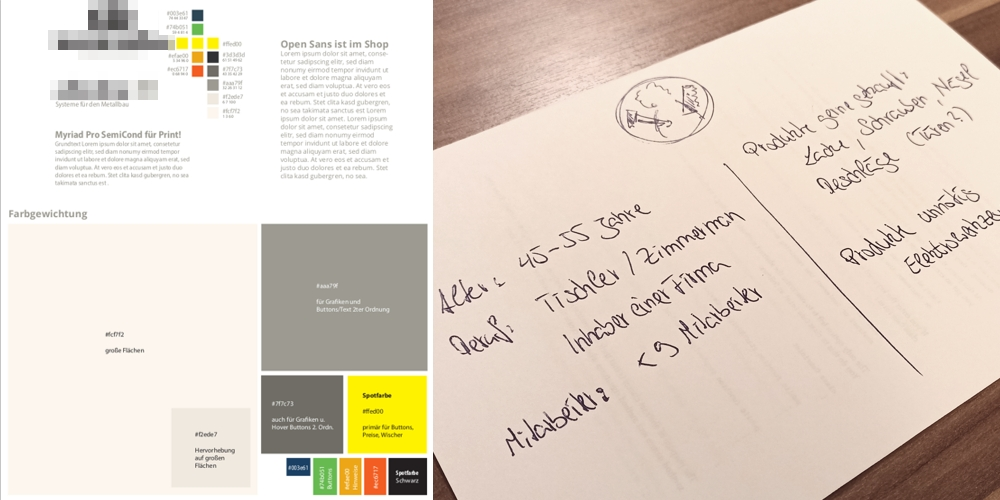

Meine Rolle: Mediengestalter Technologien: Joomla! | CSS3 | HTML5 | JavaScript | Adobe Suite CC

[Zur Website](https://shop.ks-info.com/shop.php)

**Herausforderung:** Der Shop musste in vielen Bereichen aktualisiert und besser strukturiert werden, um sich abzuheben und wieder konkurrenzfähig zu sein. Die ganze CI musste zudem vereinheitlicht werden.

**Vorgehen:** Die User-Research (Fragen an Kundenbetreuer, Vertreter, Kunden) und **Auswertung von Google-Analytics** zeigte auf, dass Produktbilder für eine Bestellung fehlten und der Anmeldeprozess sowie die Kommunikation zum Unternehmen zu kompliziert war. 
Zuerst wurde ein harmonierendes Farbschema erarbeitet, da die primären Farben nicht ausgetauscht werden sollten, Harmonierende Schriftpaare habe ich gefunden und somit konnte ich dann die Corporate Identity erstellen. 
Für die Kommunikation wurde ein ein Chat-Modul eingerichtet, da so direkt Probleme und Fragen der Kunden leichter beseitigt werden konnten und ein Newsletter-Modul wurde installiert, das kostspielige Flyer ersetzt. Als nächstes wurden Landingpages mit **HTML5/CSS3** für Shopanbindungen erstellt, damit die Kunden Bescheid wissen und ihre Bestellungen direkt in ihrer Planungs-Software tätigen konnten. 
Slider, Teaser und jede digitale Werbemaßnahme bekam dadurch ein einheitliches aussehen, die Informations-Architektur der eigentlichen **Joomla!**-Homepage wurde überarbeitet und die Seiten bekamen dadurch ein abgestimmtes, zielgerichtetes Aussehen ohne verstreute Informationen. 

**Resultat:** Nach der kompletten Bandbreite an Optimierungen vor allem in **Produktpflege,** aber auch **UX/UI-Design,** optimierter Informationsarchitektur und Werbemaßnahmen, hatte der Onlineshop das erste Mal **Rekordumsätze von bis zu 30%** zu verzeichnen und man erhielt durchweg positive Resonanz, sogar ein **Konkurrent versucht den Onlineshop zu kopieren.**

Anlegen des erweiterten Farbschemas auf Basis der ursprünglichen Logo-Farben (schwarz/gelb) und abgleichen möglichst passender Schriften für Print und Online.

&bull; &bull; &bull;

