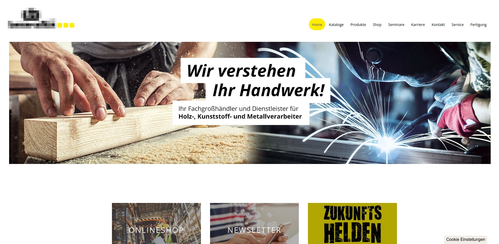

##### Der Shop musste in vielen Bereichen aktualisiert und besser strukturiert werden, um sich abzuheben und wieder konkurrenzfähig zu sein.

## 30% Umsatzsteigerung

Meine Rolle: Web- & UX-Designer | Technologien: Joomla!, CSS, HTML, JavaScript, Adobe Suite CC

    <button style="font-size: var(--fs-sm); color: var(--col-darkgray); font-weight: 600;">Beschreibung +</button>

#### Herausforderung

Auf bestehnder Struktur aufbauend, sollte der Shop modernisiert werden, um wieder konkurrenzfähig zu sein. Die Kundenbetreuer und Vertreter sollten entlastet werden, indem die Kommunikation mit den Kunden vereinfacht wird und die Kunden sollten sich besser zurechtfinden, um mehr zu bestellen.

#### Vorgehen

1. Die qualitative **User-Research** (Fragen an Kundenbetreuer, Vertreter, Kunden) und quantitative **Auswertung von Google-Analytics-Daten** zeigte auf, auf welchen Seiten die Absprungrate zu hoch war und anhand der Resonanz der Kundenbetreuer, dass zu viele Produktbilder für Bestellungen fehlten und der Anmeldeprozess sowie die Kommunikation zum Unternehmen zu kompliziert war.
2. **Proto-Persona** erstellt, damit das Team sich auf diesen einen Typ Kunden einstellt und plant.
3. **Farbschema harmonisch erweitert,** da die primären Farben nicht ausgetauscht werden sollten und man mehr Spielraum bekommt, um das Interesse des Kunden zu bekommen.
4. **harmonierende Schriftpaare** getestet und dann die **Corporate Identity** erstellt.
5. Chat-Modul eingerichtet, da so direkt Probleme und Fragen der Kunden leichter beseitigt werden konnten.
6. **Newsletter-Modul** wurde installiert, das kostspielige Flyer ersetzt und die Kunden konnten sich besser über neue Produkte informieren.
7. **Landingpages** auf Basis vorangegangener **User-Research** erstellt, um die Anbindung an die Planungssoftware zu bewerben.
8. **Produktpflege** wurde optimiert, indem die Produktbilder und Beschreibungen überarbeitet wurden.
9. Getestet wurden die Maßnahmen zuerst mittels **Heuristic Markup** und monatlich die steigenden Umsätze im Online-Shop registriert, zudem habe ich jede Änderung mit Hilfe des **5-Sekunden-Tests** überprüft.

#### Ergebnis

30% Umsatzsteigerung durch Optimierung des Online-Shops und der Kommunikation mit den Kunden.  

&#8593;  <strong>Anlegen des erweiterten Farbschemas</strong> auf Basis der ursprünglichen Logo-Farben (schwarz/gelb) und abgleichen möglichst passender Schriften für Print und Online (li.). Proto-Persona zur Planung für meine Designs und dem generellen Überblick über den Kunden und was gerne Bestellt wird (re).

