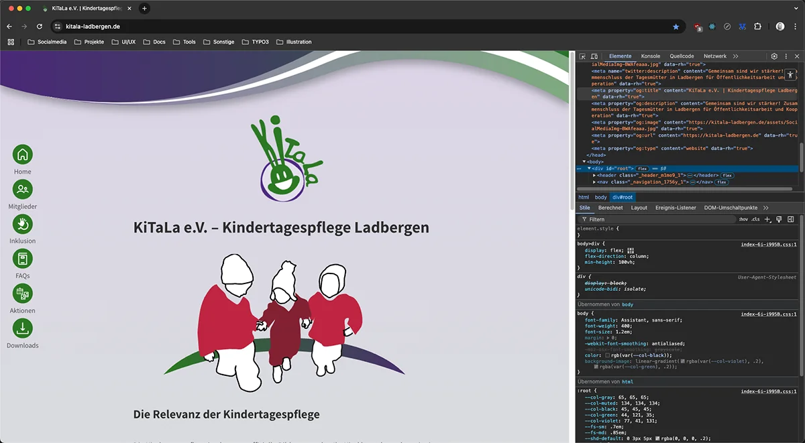
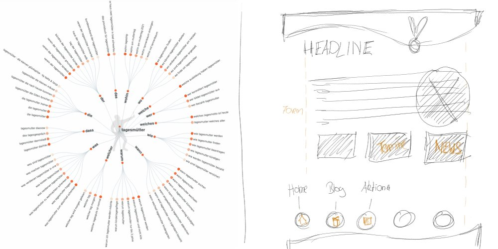
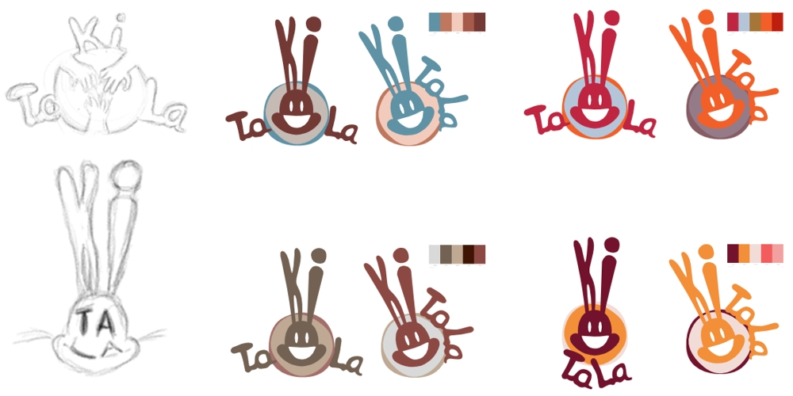
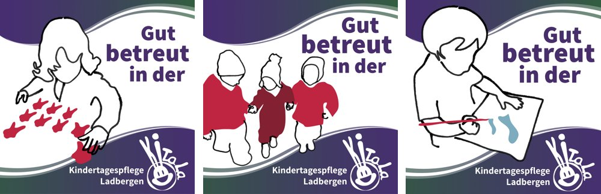

## Tagesmütter professioneller wahrgenommen

<strong>Meine Rolle:</strong> UX-Designer & Frontend-Entwickler | <strong>Technologien:</strong> React, CSS, HTML

[Zur Website &rarr;](https://kitala-ladbergen.de)

    <button style="font-size: var(--fs-sm); color: var(--col-darkgray); font-weight: var(--fw-bold);">Projektbeschreibung +</button>

#### Herausforderung

Tagesmütter wurden nicht als professionell wahrgenommen und hatten wenig Mitspracherecht in der Gemeinde, also hatten sie sich zu einem Verein zusammengeschlossen und brauchten eine passende Website. Um die professionelle Wahrnehmung zu erreichen, musste das Design aller Touchpoints konsistent sein und nicht zu verspielt wirken.

#### User-Research

- **KI-gestützte** User-Research wurde durchgeführt, um herauszufinden welche Fragen die Website beantworten muss.
- Ergebnisse **vorhandener User-Research** für Tagesmütter wurde hinzugezogen, da dort identische Themen behandelt wurden.

#### Vorgehen

1. Beim **Illustrieren des Logos** habe ich gleichzeitig auch das grundsätzliche **Farbschema erstellt**, kombiniert mit dem Farbwunsch der Tagesmütter.
2. Einige **Wireframes** der Website wurden skizziert, um eine Vorstellung zu bekommen, wie die Website aussehen könnte.
3. Das Design hielt ich sehr reduziert und entfernte alle unnötigen Spielereien, die ich normalerweise auf Seiten in diesem Bereich setzen würde.
4. **SEO-Optimierung** und **Performance-Optimierung** waren ebenfalls wichtige Punkte, die ich in der Entwicklung berücksichtigt habe.

#### Test und Validierung

- **Test und Validierung:** Auch hier habe ich die Content-Strategie mit **Heuristic Markup** und dem **5-Sekunden-Test** überprüft und optimiert, da diese Tests immer schnell zwischendurch durchzuführen sind.

#### Ergebnis

Die Website des Tagesmüttervereins ist eine gut platzierte und viel beachtete Ergänzung zur Vereinsgründung mit vielen Informationen zum Nachlesen.  

&#8593; <strong>Stichwortsuche nach Begriffen,</strong> die für die Website wichtig für Informationgehalt werden und anschließender Zeichnung der Startseite.

&#8593; <strong>Anfertigen von Skizzen</strong> für das Logo und anschließender Umsetzung im Grafikprogramm bei gleichzeitiger Entwicklung des Farbschemas.

&#8593; <strong>Socialmedia-Posts mit meinen Illustrationen,</strong> dienten dazu, die Wirksamkeit der Arbeit der Tagsmütter besser vorzustellen.

