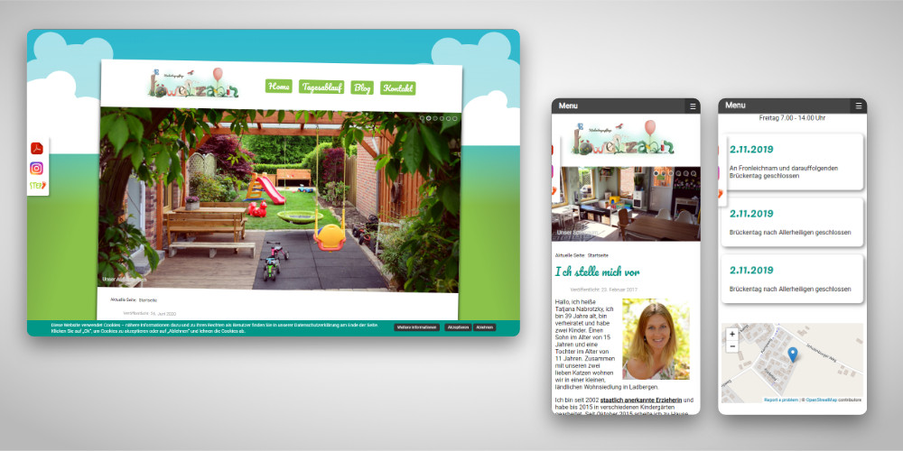
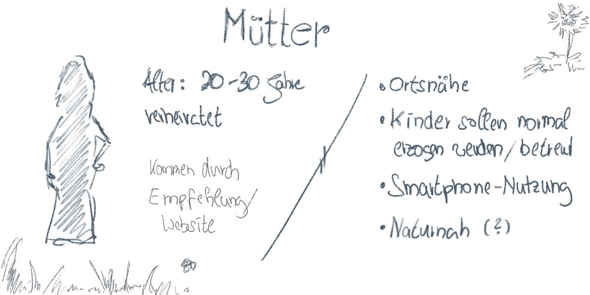
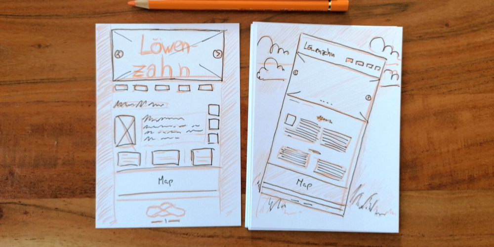

Meine Rolle: UX-Engineer 
Technologien: Joomla! | HTML5 | CSS3 | JavaScript

[Zur Website](https://xn--kindertagespflege-lwenzahn-uvc.de/index.php)

**Herausforderung:** Eine gelernte Erzieherin wollte sich möglichst schnell in der Region mit ihrer neuen Selbstständigkeit etablieren, dafür wurde neben Flyern auch eine neue Website gebraucht, die kinderfreundlich, etwas verspielt und gleichzeitig professionell wirkt.

**Vorgehen:** Für die **User-Research** habe ich mich mit junge Eltern und der Tagesmutter über häufig nachgefragten, benötigten oder fehlenden Informationen unterhalten, zudem zog ich diverse Online-Tools zu Hilfe, die mir die am meisten gesuchten Begriffe im Bereich Tagesmutter zeigten. Mit den Wünschen der Eltern und der Tagesmutter konnte ich nun eine **Informationsarchitektur** erstellen und die Seite planen.

Es sollten auch alle wichtigen Infos für die Eltern sofort sichtbar sein, Termine und Aktionen sollten selber aktualisiert werden können und für leichte Kontaktaufnahme wurde ein Formular eingeplant, zudem wurde ein buntes, aber abgestimmtes, reduziertes Farbkonzept mit grün als Basisfarbe erarbeitet.

Die Website programmierte ich in **Joomla!** und **CSS3,** das mobile Menü mit **JavaScript** und es wurden **CSS-Animationen** erstellt.

**Resultat:** Das kinderfreundliche Gesamtbild, die Informationsarchitektur und gute SEO brachten der Seite **beste Präsenz und Resonanz** in der lokalen Region und vor allem bei suchenden Eltern.

Anlegen einer Proto-Persona mit weiteren Infos, wie Kita gefunden wurde (li). Logoentwicklung mit Vorabskizze (re).

Exportierte CSV-Datei der Suchbegriffe eines Online-Tools. Damit konnte ich die grundsätzlichen Inhalte als Platzhalter, bis der richtige Text da war, auf der Website aufbauen (li.). Ideation und Wireframing von den ersten Entwürfen auf Papier (re).

&bull; &bull; &bull;

