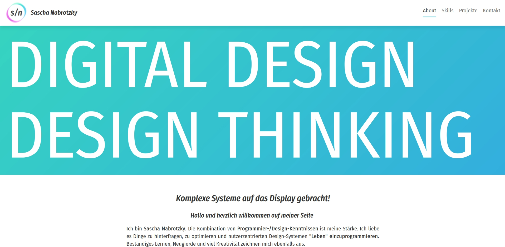

##### Mein berufliches Skillset sollte bestmöglich für Recruiter erfassbar optimiert werden

## Professionelles Auffallen durch optimierte Portfolioseite und weiterer Online-Präsenzen

Meine Rolle: UX-Engineer 
Technologien: React.js | Gatsby.js | SCSS | GraphQL

**Herausforderung**

Sowohl die Programmier- als auch meine UX-Design-Fähigkeiten mussten dabei deutlich sichtbar auf der neuen Website erscheinen.

**Vorgehen**

1. **User-Research** im Bereich Recruiter und Personalvermittler, um die Anforderungen an eine Portfolio-Seite zu ermitteln.
2. Design und Entwicklung einer **Portfolio-Seite** mit **Gatsby.js** und **React.js**.
3. **Test und Validierung** der Seitenstruktur und Content-Strategie mit **Heuristic Markup** und einem **5-Sekunden-Test**.
