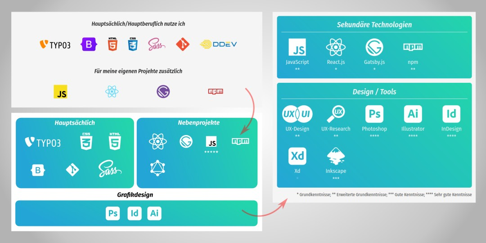

Meine Rolle: UX-Engineer Technologien: Gatsby | SCSS | Inkscape

[Zur Website](https://sascha-nabrotzky.github.io/skills)

**Herausforderung:** Die Darstellung meiner beruflichen Fähigkeiten wirkte zerstreut und es wurden nicht alle Fragen (z. B. für Recruiter) beantwortet, deswegen sollten alle meine Fähigkeiten übersichtlicher zusammengefasst und zudem leicht erfassbar der aktuelle Wissenstand gezeigt werden.

**Vorgehen:** Ich baute zuerst den Bereich im Groben in Inkscape nach und testete ein paar Möglichkeiten aus, das letztendliche Feintuning habe ich dann direkt bei der Umsetzung mit **SCSS/CSS3** im Projekt gemacht. Die Bereiche "Hauptberuflich" und "Nebenprojekte" wurden zu etwas allgemeineren Formulierungen umbenannt (Primär, Sekundär) und der Bereich "Design" kam hinzu. Zur besseren Einordnung meines Wissensstandes setzte ich kleine Sterne unter die einzelnen Logos und eine Legende unten drunter, außerdem kamen ausgeschriebene Namen zu den einzelnen Technologien hinzu, da sie nicht jeder sofort anhand des Logos erkennt.

**Test und Validierung:** Die Änderungen habe ich mit **Heuristic Markup** und einem **5-Sekunden-Test** überprüft, mit den Anforderungen von Recruitern verglichen und dann weiter optimiert.

**Resultat:** Unterstützt von den zusammenfassenden Bereichen mit den allgemeineren Überschriften und den ausgeschriebenen Technologienamen gibt die Gestaltung sofortige Orientierung, zudem zeigen die Sterne recht deutlich, wie fortgeschritten man in den einzelnen Tools ist. Die einheitliche Farbgebung der weißen Logos und der gleichen Farbverläufe geben dem ganzen viel mehr Ruhe.

&bull; &bull; &bull;

