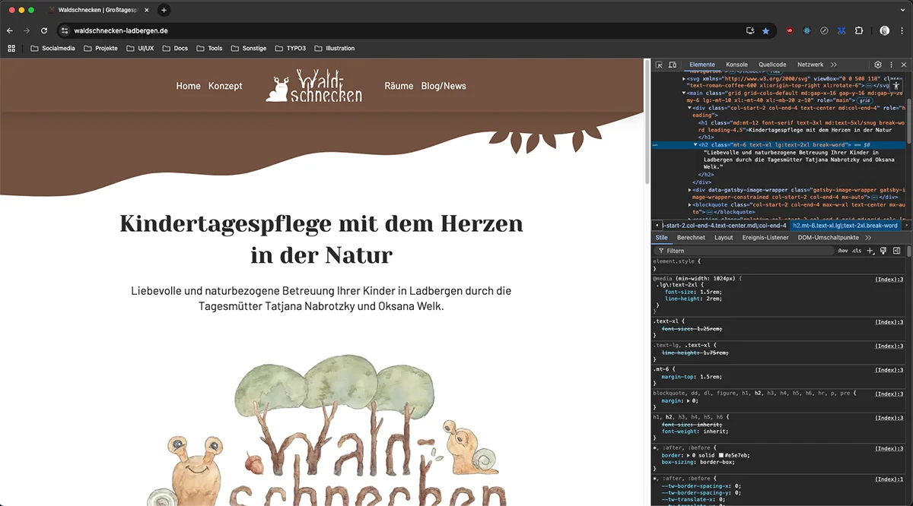
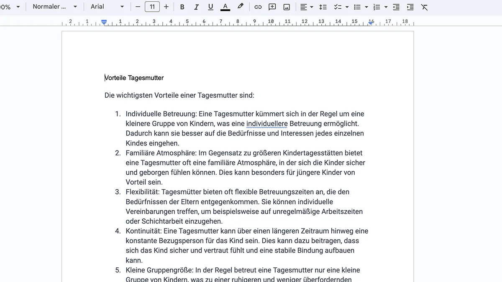
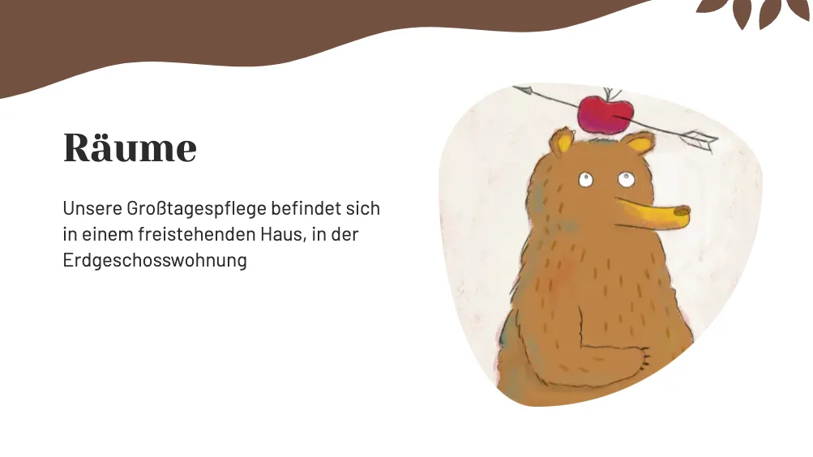

##### Zwei Tagesmütter haben sich zu einer Kindergroßtagespflege zusammengeschlossen und auch diese sollte sich wieder etablieren.

## Kita-Plätze lange im Vorraus ausgebucht

Meine Rolle: Web- & UX-Designer 
Technologien: Gatsby | React | HTML | CSS | JavaScript

[Zur Website](https://waldschnecken-ladbergen.de)

    <button>Beschreibung +</button>

#### Herausforderung

Es wurde eine neue Website gebraucht, die kinderfreundlich, etwas verspielt und gleichzeitig professionell wirkt.

#### Vorgehen

1. **User-Research** mit KI- und Online-Tools, was die Kindertagespflege ausmacht und Eltern erwarten.
2. **Informationsarchitektur** und **Wireframing** auf Basis der Recherche.
3. Es wurde ein buntes, aber abgestimmtes, reduziertes **Farbkonzept** mit natürlichen Tönen, die zum Thema "Wald" passen erarbeitet.
4. **Logoentwicklung** mit Vorabskizze.
5. Die Website programmierte ich in **React, Gatsby, HTML** und **CSS** und die Vorteile-Blöcke wurden etwas animiert.
6. Erstellen von Illustrationen, da diese die kinderfreundliche Atmosphäre unterstützen.
7. **SEO- und Pagespeed-Optimierung** damit die Website gut gefunden wird und schnell lädt.

#### Ergebnis

Kitaplätze sind lange im Vorraus ausgebucht oder vorgemerkt und die Tagesmütter konnten sich auch mit der Kindergroßtagespflege wieder etablieren.  

&#8593; <strong>KI-gestützte User-Research,</strong> um die Vorteile der Tagesmutter und die Erwartungen der Eltern herauszufinden.

&#8593; <strong>Für die kinderfreundliche Atmosphäre</strong> wurden, wie das Logo selber, einige Illustrationen für die einzelnen Seiten erstellt.

